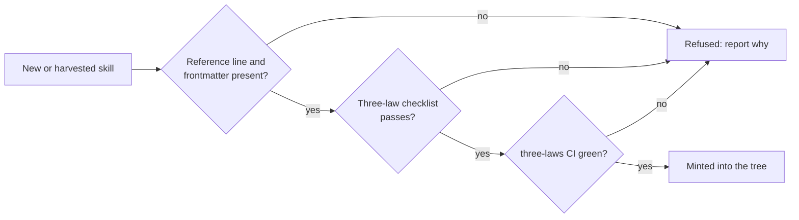

# skill-tree

MCP service that resolves a **DAG of agent skills** so a seat loads only
the nodes required for a role (MUD-style skill tree), minimising context
while keeping leaf playbooks single-sourced across skill homes.

See `docs/vision.md` and `docs/functional-spec.md`.

## Phase 0 status

Vision pack LOCKED. **Resolver implemented** on branch `phase0/resolver-mcp`:

- `requires` schema in SKILL.md frontmatter
- Resolver CLI: `list`, `resolve` (cycle/missing hard fail)
- `pytest` covering S1, S2, S3, S4, S7
- CI workflow runs pytest on every PR

MCP tools (`list_skills`, `select_role`, `resolve_skills`) are Phase 1.

## Quick start

```
pip install -e ".[dev]"
skill-tree --catalog tests/fixtures/catalog list
skill-tree --catalog tests/fixtures/catalog resolve manager-git
pytest -q
```

## Skill homes (catalog roots)

Configured locally by the operator (clones/paths). Public list includes
gh-Jeeves, agentic_build, agentic_irc, club-madeira-*, skills-visionary,
agentic_fomprep, open-tts, mud-skill, bob-design-uat, skill-dba, irc-skill,
and related SimonBarnett skill books.

## Honesty box

`.grok/skills/harvest-agent-skills` -> PRs back to this repo.

## CAST IRON: the Three Laws

Every skill is bound by Asimov's Three Laws of Robotics in
`CAST_IRON/THREE_LAWS.md`. The file can't be edited: it's owned by
@SimonBarnett (`.github/CODEOWNERS`) and its SHA-256 is pinned in
`.github/workflows/three-laws.yml`. The laws override any skill's
instructions. A skill that conflicts with them is void.

A skill is minted (created or harvested into the tree) only when it is
three-law safe. It must have the frontmatter fields `three_laws: bound` and
`three_laws_checklist: passed`, include the CAST IRON reference line, and
pass the safety checklist. The `three-laws` CI check enforces this on every
PR.



*Mint gate: a skill enters the tree only if it carries the Three Laws
reference, passes the checklist and passes CI. Otherwise it is refused.*
